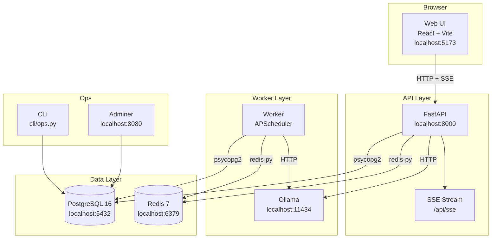
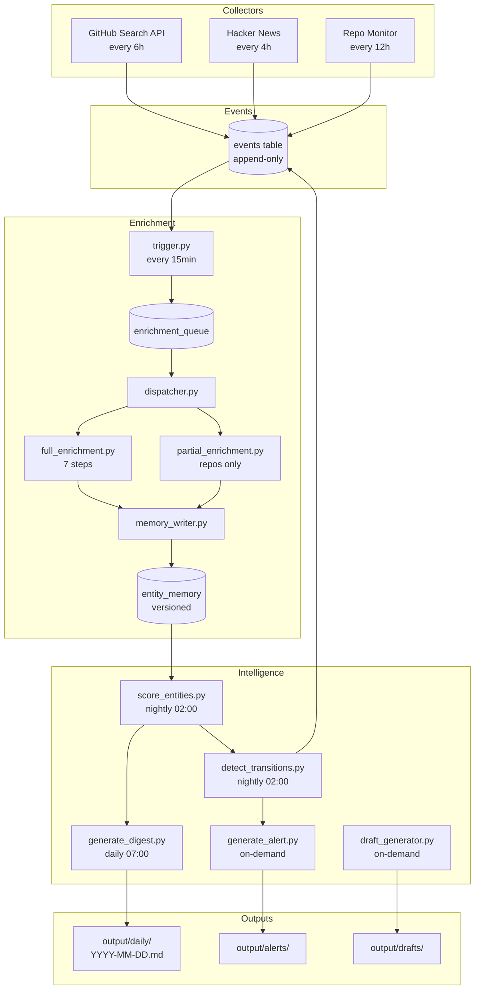
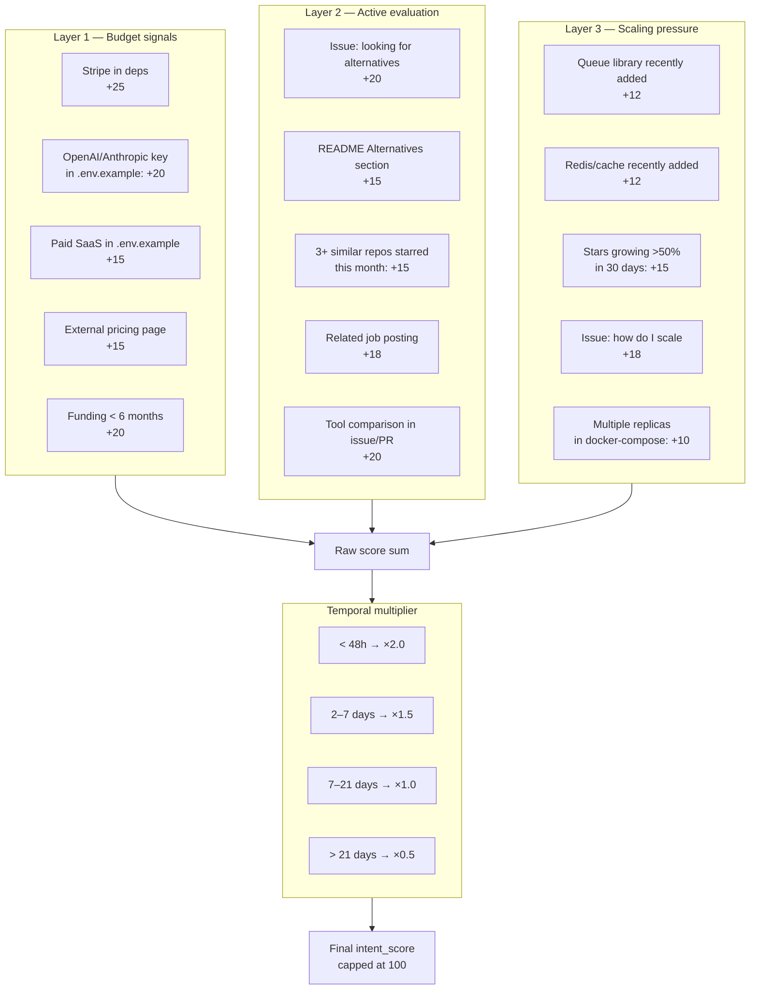
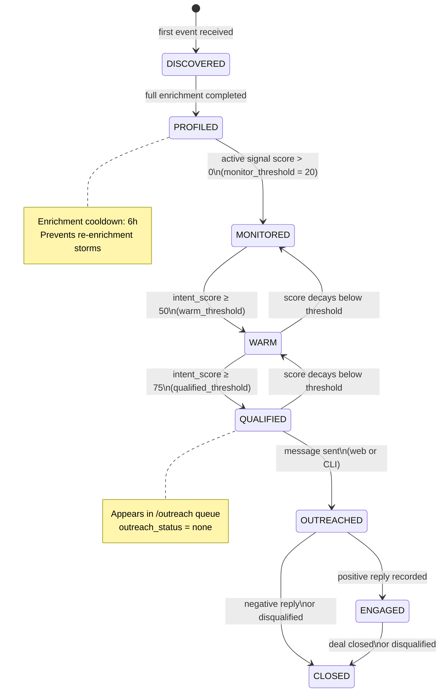
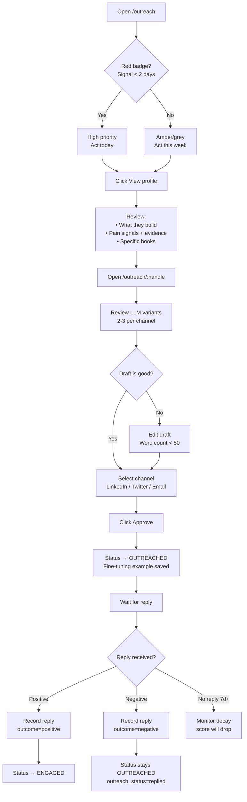
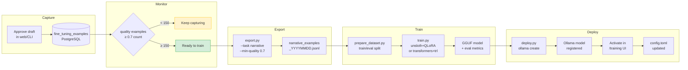

# Operations Manual — Dev Intelligence Platform

> Continuous intelligence system for developer ecosystems. Operated by a single person.

---

## Table of Contents

1. [What is this system?](#1-what-is-this-system)
2. [Architecture](#2-architecture)
3. [Initial setup](#3-initial-setup)
4. [Configuration](#4-configuration)
5. [Daily operation — make commands](#5-daily-operation--make-commands)
6. [Web interface](#6-web-interface)
7. [Operational CLI](#7-operational-cli)
8. [Data pipeline](#8-data-pipeline)
9. [Collectors](#9-collectors)
10. [Enrichment](#10-enrichment)
11. [Scoring and intent](#11-scoring-and-intent)
12. [Intelligence outputs](#12-intelligence-outputs)
13. [Outreach flow](#13-outreach-flow)
14. [Fine-tuning](#14-fine-tuning)
15. [Dependency taxonomy](#15-dependency-taxonomy)
16. [API reference](#16-api-reference)
17. [Troubleshooting](#17-troubleshooting)
18. [Glossary](#18-glossary)

---

## 1. What is this system?

**Dev Intelligence Platform** is an operational intelligence tool that monitors GitHub and Hacker News to detect developers building in the AI agents, MCP infrastructure, and browser automation space.

### What it does

- Discovers active developers by GitHub topics and HN signals
- Builds longitudinal technical profiles: stack, archetypes, pain signals, product maturity
- Detects intent transitions (when a developer moves from exploring to buying)
- Generates contextual outreach with explicit evidence — no fabricated claims
- Accumulates fine-tuning examples to progressively improve LLM output quality

### What it is NOT

- **Not a CRM** — no sales pipeline, no deals, no forecasting
- **Not a monitoring tool** — no server observation, no downtime alerts
- **Not a SaaS** — runs on your machine, in your containers, with your data

### Core principle

Every action in the system produces an **immutable, append-only event**. A developer's memory is a projection of their events — never a directly editable record. This guarantees full traceability: you can always explain why the system says what it says.

---

## 2. Architecture

The system runs as **7 Docker Compose services**:



| Service | Image | Role |
|---|---|---|
| `postgres` | postgres:16-alpine | Primary database — JSONB, events, profiles |
| `redis` | redis:7-alpine | LLM cache, operational state, rate limits |
| `ollama` | ollama/ollama | Local LLM — extraction, narrative, drafts |
| `api` | custom build | FastAPI REST + SSE — all data routes |
| `web` | custom build | React + Vite — operational interface |
| `worker` | custom build | Collectors, enrichment, APScheduler |
| `adminer` | adminer | PostgreSQL visual inspector |

---

## 3. Initial setup

### Prerequisites

- Docker Desktop (Mac/Linux) or Docker Engine + Compose Plugin
- Git
- 8 GB RAM minimum (Ollama needs ~4 GB per model)
- GitHub Personal Access Token with scopes: `public_repo`, `read:user`
- Optional: Anthropic API Key (to use Claude instead of Ollama)

### Installation

```bash
# 1. Clone
git clone <repo-url> developers-crm
cd developers-crm

# 2. Configure environment
cp .env.example .env
# Edit .env — set your tokens (see section 4)

# 3. Start all services
make up

# 4. Initialize the database
make migrate

# 5. Download an LLM model (first time only)
make pull-model        # Downloads llama3.2:3b (~2 GB)

# 6. Verify everything is running
make health
make test

# 7. First collection run
make collect
```

If `make health` shows all services green and `make test` passes all foundation checks: **the system is ready**.

### URLs after setup

| URL | What it is |
|---|---|
| http://localhost:5173 | Web interface (daily operations) |
| http://localhost:8000/docs | API Swagger UI |
| http://localhost:8080 | Adminer (DB inspector) — user: `devint`, pass: see `.env` |

---

## 4. Configuration

### Environment variables (`.env`)

```bash
# PostgreSQL
POSTGRES_DB=dev_intelligence
POSTGRES_USER=devint
POSTGRES_PASSWORD=change_this_in_production

# Redis
REDIS_URL=redis://redis:6379/0

# GitHub — required for collectors
GITHUB_TOKEN=ghp_your_token_here      # github.com → Settings → Developer settings → PAT

# Anthropic — optional, to use Claude instead of Ollama
ANTHROPIC_API_KEY=sk-ant-your_key     # console.anthropic.com

# Ollama
OLLAMA_HOST=http://ollama:11434

# App
APP_ENV=development
API_PORT=8000
WEB_PORT=5173
API_TOKEN=generate_with_openssl_rand_hex_32
VITE_API_TOKEN=${API_TOKEN}
```

> **Generate a secure API_TOKEN:**
> ```bash
> openssl rand -hex 32
> ```

### `config.toml` — system behavior

This file controls the core behavior. Editable from the web at `/system/config`.

#### `[ecosystem]` — what to watch

```toml
[ecosystem]
name = "ai_automation_builders"
github_topics = ["mcp", "langchain", "browser-automation", "ai-agent", "playwright-automation", "llm-agent", "ai-tools"]
primary_languages = ["Python", "TypeScript"]
min_stars = 5           # repos with fewer stars are ignored
max_stars = 5000        # larger repos are usually companies, not indie devs
created_after = "2024-01-01"
```

Modify `github_topics` to shift the monitored ecosystem. Each topic is queried against the GitHub Search API.

#### `[scoring]` — transition thresholds

```toml
[scoring]
qualified_threshold = 75.0   # intent_score >= 75 → QUALIFIED
warm_threshold = 50.0        # intent_score >= 50 → WARM
monitor_threshold = 20.0     # intent_score >= 20 → MONITORED
reactivation_multiplier = 0.75
```

Lower `qualified_threshold` for more candidate volume. Raise it for higher precision.

#### `[llm]` — AI provider

```toml
[llm]
provider = "ollama"          # "ollama" (local, free) or "anthropic" (cloud, paid)

# Models per task — can use different models for each
ollama_model_extraction = "llama3.2:3b"
ollama_model_narrative  = "llama3.2:3b"
ollama_model_draft      = "llama3.2:3b"

# If switching to anthropic:
anthropic_model_extraction = "claude-haiku-4-5-20251001"
anthropic_model_narrative  = "claude-sonnet-4-6"
anthropic_model_draft      = "claude-sonnet-4-6"

ollama_timeout_seconds = 180
ollama_temperature     = 0.3
cache_ttl_extraction   = 86400   # 24h cache for extraction
cache_ttl_narrative    = 43200   # 12h for narrative
cache_ttl_draft        = 21600   # 6h for drafts
min_readme_words       = 150     # skip LLM if README is shorter
min_confidence         = 0.6     # gate — below this, not surfaced
archetype_llm_threshold = 0.75  # below this, call LLM to disambiguate
```

> **Recommendation:** Use `llama3.2:3b` for development (fast, lightweight). If you have a GPU or patience, `llama3.1:8b` or `qwen2.5:7b` produce significantly better narrative quality.

#### `[collectors]` — collection frequency

```toml
[collectors]
github_scan_interval_hours   = 6    # how often to search for new repos
hn_scan_interval_hours       = 4    # how often to read HN
monitor_interval_hours       = 12   # how often to revisit known repos
enrichment_poll_minutes      = 15   # how often to process the enrichment queue
max_repos_per_monitor_run    = 100
max_issues_per_repo          = 20
```

#### `[output]` — report schedule

```toml
[output]
daily_digest_hour    = 7       # UTC hour for daily digest generation
weekly_report_day    = "sunday"
weekly_report_hour   = 18      # UTC hour for weekly report
```

---

## 5. Daily operation — make commands

### Core commands

```bash
make collect      # Run all collectors (GitHub search + HN + repo monitor)
make enrich       # Process enrichment queue (one batch)
make digest       # Generate today's daily digest
make health       # Check state of all services
```

### Inspection commands

```bash
make cache-stats  # How many LLM responses are cached in Redis
make github-rate  # Remaining GitHub API requests
make logs         # Stream all service logs
make logs-api     # Stream API logs only
make logs-worker  # Stream worker logs only
```

### Database commands

```bash
make migrate      # Apply schema.sql (idempotent — safe to run multiple times)
make backup       # Dump PostgreSQL to a timestamped .sql.gz file
make restore FILE=backups/backup_20260521_120000.sql.gz
```

### Debug shells

```bash
make shell-api    # bash inside the api container
make shell-db     # psql directly into PostgreSQL
make shell-redis  # redis-cli
```

### Suggested weekly operation cycle

| When | Action |
|---|---|
| Monday morning | `make collect && make enrich` |
| Review web | Open `/dashboard` and `/alerts` |
| Approve outreach | Review `/outreach` → `/outreach/:handle` |
| Friday | `make backup` |
| Sunday 18:00 UTC | System auto-generates the weekly report |

### Worker job schedule

```mermaid
gantt
    title Worker APScheduler — jobs per day (UTC)
    dateFormat HH:mm
    axisFormat %H:%M

    section Every 4h
    HN scan          :active, 00:00, 4h
    HN scan          :active, 04:00, 4h
    HN scan          :active, 08:00, 4h
    HN scan          :active, 12:00, 4h
    HN scan          :active, 16:00, 4h
    HN scan          :active, 20:00, 4h

    section Every 6h
    GitHub scan      :crit, 00:00, 6h
    GitHub scan      :crit, 06:00, 6h
    GitHub scan      :crit, 12:00, 6h
    GitHub scan      :crit, 18:00, 6h

    section Every 12h
    Repo monitor     :done, 00:00, 12h
    Repo monitor     :done, 12:00, 12h

    section Every 15min
    Enrichment queue :milestone, 00:00, 1m

    section Nightly
    Scoring + transitions :crit, 02:00, 1h
    Daily digest          :active, 07:00, 1h
```



---

## 6. Web interface

Open http://localhost:5173 to access the interface. All daily operations happen here.

### Dashboard (`/dashboard`)

The main view. Shows:

- **System health** — real-time status (ok / degraded)
- **Redis cache** — LLM cache memory usage
- **GitHub rate** — remaining requests before the API limit
- **Enrichment queue** — pending jobs in queue

The **ecosystem charts** display developer distribution by status (donut) and by archetype (list).

In the bottom-right corner, **SSE toasts** appear in real time when the worker completes an enrichment or when a developer changes status. They auto-dismiss after 5 seconds.

### Entities (`/entities`)

List of all detected developers. Available filters:

- **Handle search** — type to filter instantly
- **Status** — DISCOVERED, PROFILED, MONITORED, WARM, QUALIFIED, OUTREACHED, ENGAGED
- **Archetype** — solo_agent_builder, mcp_platform_builder, etc.
- **Trajectory** — rising, stable, declining
- **Minimum intent score** — slider from 0 to 100

Each card shows the handle, status (color badge), archetype, intent and maturity scores, and trajectory direction.

Click any card to open the **full profile**.

### Entity profile (`/entities/:handle`)

The densest view in the system. Two columns:

**Left column — developer data:**
- Scores (intent, maturity) with visual bars
- Trajectory and archetype
- Links to GitHub and LinkedIn
- Specific hooks (the most concrete angles for reaching this person)

**Right column — detail sections:**
- **Narrative** — paragraph summarizing who they are, what they're building, and why it matters
- **Pain signals** — each PainSignal with category, description, and literal evidence
- **Tech stack** — dependencies grouped by category
- **Score history** — intent and maturity chart over time
- **Events** — timeline of everything the system recorded about this developer

**Actions available from the profile:**
- **Note** — add an operator comment (recorded as `developer.note_added` event)
- **LinkedIn** — record manual LinkedIn data (title, company, team size)
- **Enrich** — force an immediate re-enrichment outside the queue
- **Disqualify** — mark the developer as not relevant (asks for confirmation + reason)

### Outreach (`/outreach`)

Queue of developers in QUALIFIED status with `outreach_status = none` (never contacted). Ordered by urgency:

- **Red badge** — enrichment < 2 days old (very fresh signal)
- **Amber badge** — 2 to 5 days
- **Grey badge** — more than 5 days (signal may be cooling)

Each card shows the truncated narrative, the top 2 specific hooks, and a "View draft →" button.

### Draft viewer (`/outreach/:handle`)

Where you review, edit, and approve outreach before sending.

**Left column — context:**
- Scores, narrative, hooks, and pain signals for the developer

**Right column — the draft:**
- **Variants** generated by the LLM (up to 2-3 variants per channel)
- Free-text editor per variant — word count shown (warning if > 50 words)
- "Edited" badge when you modify the original text

**Actions:**
1. Choose channel (LinkedIn / Twitter / Email)
2. Edit the text if needed
3. Click **Approve** → records the fine-tuning example in PostgreSQL
4. The system shows the **reply form** — when the developer responds, record the outcome (positive / neutral / negative) and notes

> **Important:** Approving an unedited draft counts as a quality example ≥ 0.7. Editing it also counts, but with a score proportional to how much you changed the original.

### Digest (`/digest`)

The daily digest generated at 07:00 UTC. Five collapsible sections:

- ◈ **New entities** — developers discovered yesterday
- ⟳ **Transitions** — status changes (PROFILED → MONITORED, etc.)
- ⚑ **Alerts** — strong intent signals
- ⬡ **Stack changes** — dependency changes in monitored repos
- ★ **Notable activity** — relevant events of the day

`@username` handles are direct links to the profile. Use the date picker to view past digests.

### Alerts (`/alerts`)

Individual alerts generated when a developer crosses the strong intent threshold. Each alert has:

- **Urgency badge** (red = < 2 days, amber = 2-5 days, grey = archived)
- Content preview
- Direct buttons: **View profile** and **View draft**

### Trends (`/trends`)

Ecosystem distribution of monitored developers:

- **Tech stack** — bar chart of technologies by mentions across repos
- **Archetypes** — horizontal distribution of builder types
- **Primary languages** — table with proportional bars
- **Weekly report** — generated every Sunday at 18:00 UTC

### System Health (`/system/health`)

System monitoring panel, updated every 30 seconds:

| Check | What it verifies |
|---|---|
| PostgreSQL | Ping — responds to SELECT 1 |
| Redis | Ping + memory used in MB |
| Ollama | Available loaded models |
| Worker | Activity in the last 30 minutes |
| GitHub rate limit | Remaining requests (from Redis) |
| LLM cache | Cached keys + footprint in MB |
| Daily digest | Today's file exists |

**24h metrics** — events emitted, enrichments completed, cache hits.

### System Config (`/system/config`)

`config.toml` editor from the interface. Collapsible sections, auto-inferred types (boolean, number, array, string). The **Save** button writes the file to the mounted volume and reloads configuration without restarting services.

### Taxonomy (`/system/taxonomy`)

Paginated table of the `taxonomy/dependencies.json` file. Each row is an npm/pip package and its metadata:

| Field | Meaning |
|---|---|
| `category` | Category (ai_llm, browser_automation, etc.) |
| `intent_weight` | Points added to intent score when detected |
| `maturity_modifier` | Points added to maturity score |
| `scaling_signal` | Whether detection indicates the developer is scaling |
| `budget_signal` | Whether detection indicates available budget |
| `archetype_signals` | Archetypes this package reinforces |

You can **search**, **edit** each package, or **add** a new one from the interface.

### Fine-tuning (`/training`)

Fine-tuning pipeline management panel. See [section 14](#14-fine-tuning) for the complete flow.

---

## 7. Operational CLI

The CLI runs **inside the api container** and is the alternative access to the web for quick operations.

```bash
# General form
docker compose exec api python cli/ops.py <command> --entity <handle> [options]
```

### `show` — view entity summary

```bash
docker compose exec api python cli/ops.py show --entity johndoe

# Output:
# Summary
# Entity: johndoe
# Status: QUALIFIED
# Intent score: 82.5
# Maturity score: 67.0
# Trajectory: rising
# Archetype: solo_agent_builder
# Last active: 2026-05-21T14:33:00+00:00
# Outreach status: none
#
# Pain Signals
# - api_cost: High API usage detected | evidence: openai in requirements.txt
#
# Narrative
# johndoe is building an AI-native scheduling tool...
#
# Specific Hooks
# - Mention the cost issue with the OpenAI API
```

### `note` — add an operator note

```bash
docker compose exec api python cli/ops.py note \
  --entity johndoe \
  --text "Saw him in #mcp-builders on Discord. Mentioned evaluating alternatives."
```

The note is recorded as a `developer.note_added` event and updates the developer's memory.

### `linkedin` — record LinkedIn data

```bash
docker compose exec api python cli/ops.py linkedin --entity johndoe
# CLI prompts interactively:
# Job title: Senior AI Engineer
# Company: Acme Inc
# Team size: 6-20
# Notes: works on platform team
```

### `disqualify` — disqualify an entity

```bash
docker compose exec api python cli/ops.py disqualify \
  --entity johndoe \
  --reason "company, not indie developer — doesn't fit ICP"
```

Sets status to CLOSED and `outreach_status` to `disqualified`. The developer disappears from the outreach queue.

### `outreach` — record message sent

```bash
docker compose exec api python cli/ops.py outreach \
  --entity johndoe \
  --channel linkedin   # email | twitter | linkedin
```

Sets status to OUTREACHED. Use this if you sent the message manually from outside the web interface.

### `reply` — record developer response

```bash
docker compose exec api python cli/ops.py reply \
  --entity johndoe \
  --outcome positive   # positive | negative | neutral
  --notes "Interested in talking. Replied in < 1h."
```

If outcome is `positive`, status moves to ENGAGED.

### `enrich` — force re-enrichment

```bash
# Full: downloads GitHub profile + repos + README + complete LLM analysis
docker compose exec api python cli/ops.py enrich --entity johndoe --mode full

# Partial: updates existing repos only (faster, no LLM)
docker compose exec api python cli/ops.py enrich --entity johndoe --mode partial
```

### `training-stats` — view fine-tuning progress

```bash
docker compose exec api python cli/ops.py training-stats

# Training Stats
# - narrative: total=12 quality>=0.7=9 edit_rate_avg=33.33%
# - draft: total=8 quality>=0.7=6 edit_rate_avg=50.00%
#
# Quality examples accumulated: 15
# ETA to 150 examples: 135 remaining.
```

---

## 8. Data pipeline

The system follows this end-to-end flow:



### The `events` table — the heart of the system

Everything that happens generates an event. **Never deleted or edited.** If information changes, a new event is emitted.

```sql
-- View recent events for a developer
SELECT event_type, created_at, payload
FROM events
WHERE entity_id = 'johndoe'
ORDER BY created_at DESC
LIMIT 20;
```

### The `entity_memory` table — versioned projection

Every time something relevant happens, the system generates a new version of the developer's memory. The latest version is what the interface displays.

```sql
-- View memory versions for a developer
SELECT version, created_at
FROM entity_memory
WHERE entity_id = 'johndoe'
ORDER BY version DESC;
```

---

## 9. Collectors

Collectors run automatically in the worker (APScheduler) and can also be triggered manually.

### GitHub Search — discovery by topics

```bash
docker compose exec worker python collectors/run_all.py --collector github
```

Searches GitHub for repos with the topics from `config.toml [ecosystem]`. For each new repo:
1. Extracts the owner (developer)
2. Emits `developer.discovered` + `repository.discovered`
3. Queues for enrichment

**Limit:** 1,000 results per topic (GitHub Search API constraint).

### Hacker News — intent signals from discussions

```bash
docker compose exec worker python collectors/run_all.py --collector hn
```

Reads recent HN posts and comments. Looks for GitHub handles mentioned in contexts like:
- "looking for alternatives to..."
- "how do I scale..."
- "what tool do you use for..."

### GitHub Monitor — tracking known repos

```bash
docker compose exec worker python collectors/run_all.py --collector monitor
```

Revisits repos of developers already in the DB. Detects:
- New commits (emits `repo.commit_detected`)
- Stars spikes (emits `repo.stars_spiked`)
- Dependency changes (emits `repo.dependency_changed`)

### Run all collectors

```bash
make collect
# equivalent to:
docker compose exec worker python collectors/run_all.py --collector all
```

---

## 10. Enrichment

Enrichment builds the complete technical profile of a developer.

### Full enrichment — 7 steps

```mermaid
flowchart LR
    START([Developer ID]) --> S1

    S1[1. Fetch repos\nfrom DB or GitHub API]
    S2[2. Select primary repo\nstars × recency score]
    S3[3. Parse dependencies\ntaxonomy/dependencies.json]
    S4[4. Fetch repo profile\nCI · Docker · issues · README]
    S5[5. Compute maturity score\nheuristic signals]
    S6[6. LLM enrichment\npain_detector · readme_extractor\narchetype_classifier]
    S7[7. Write to DB\ndevelopers · repositories\nentity_memory]
    DONE([enrichment.completed event])

    S1 --> S2 --> S3 --> S4 --> S5
    S5 --> S6
    S6 -- readme_words < 150 --> SKIP[skip LLM\nheuristic fallback]
    S6 --> S7
    SKIP --> S7
    S7 --> DONE

    style S6 fill:#f0e6ff,stroke:#9966cc
    style SKIP fill:#f5f5f5,stroke:#999
```



**Step 1 — GitHub repos:** fetches repos from the DB first, GitHub API as fallback.

**Step 2 — Primary repo selection:** scores repos using `stars × 1/log(days_since_push + 2)`. The highest-scoring repo becomes the primary enrichment target.

**Step 3 — Dependency parsing:** reads `requirements.txt`, `package.json`, `pyproject.toml`, or `Pipfile`. Maps each package against `taxonomy/dependencies.json`. Produces a `StackSnapshot` with deps grouped by category.

**Step 4 — Repo profile:** fetches from GitHub API: CI presence, Dockerfile, `.env.example` services, open issues (up to 20), README content.

**Step 5 — Maturity scoring:** evaluates product maturity by objective signals (tests, CI/CD, pricing, custom domain, Stripe, auth library, active commits). Returns a `MaturityResult` with score and tier.

**Step 6 — LLM enrichment** (only if `readme_word_count >= 150`):
- `readme_extractor.py` — extracts product type, target user, pain solved, limitations
- `pain_detector.py` — identifies pain signals from issues and README, classifies into categories
- `archetype_classifier.py` — classifies the developer into one of 6 archetypes

**Step 7 — Write to DB:** upserts developers and repositories tables, writes new `entity_memory` version, emits `enrichment.completed`.

### Partial enrichment — fast update

Only updates existing repos (commits, stars, deps). No LLM calls. Much faster — used by the 12h repo monitor.

### Enrichment queue inspection

```bash
# Check queue status
docker compose exec api python -c "
from db import db_cursor
with db_cursor() as cur:
    cur.execute('''
        SELECT status, COUNT(*) FROM enrichment_queue
        GROUP BY status ORDER BY status
    ''')
    for row in cur.fetchall():
        print(dict(row))
"
```

### Rate limits and throttling

The worker processes the queue every 15 minutes. Each enrichment calls the GitHub API, Ollama, and PostgreSQL. If the GitHub rate limit is exhausted, the worker waits until it renews (resets every hour). The remaining rate limit is cached in Redis and visible at `make github-rate`.

---

## 11. Scoring and intent

### Intent score (0–100)

Measures the probability that a developer is actively seeking a solution.



### Signal decay (half-life in days)

| Signal category | Half-life |
|---|---|
| product_launch | 2 days |
| tool_comparison | 3 days |
| stars_spike | 5 days |
| dependency_added (hot stack) | 7 days |
| commit_velocity | 10 days |
| hiring_signal | 14 days |
| article_published | 14 days |
| funding_event | 21 days |
| issue_pain | 30 days |
| stack_inference | never expires |

### Maturity score (0–100)

Measures how mature the developer's product is. High maturity suggests the developer has budget and can make tool decisions.

| Signal | Points |
|---|---|
| TypeScript (not JS) | +10 |
| Test framework in devDeps | +10 |
| CI/CD with deploy step | +15 |
| CI multi-environment | +10 |
| E2E test framework | +8 |
| Dockerfile present | +8 |
| Stripe in deps | +12 |
| Auth library (not just JWT) | +8 |
| Zod/Pydantic/io-ts | +8 |
| Landing page with pricing | +10 |
| Demo URL resolves (200) | +8 |
| Sentry/Datadog in .env.example | +8 |
| Analytics library | +6 |
| ESLint/Prettier | +5 |
| Coverage badge in README | +5 |
| CONTRIBUTING.md | +5 |
| CHANGELOG semver | +5 |
| Pinned dependencies | +5 |
| docs/ with content | +5 |
| Commit in last 7 days | +10 |
| ≥1 release in last 30 days | +8 |
| Issue response < 48h avg | +6 |
| Multiple contributors | +5 |
| Stars growing > 10%/month | +5 |

**Targetable sweet spot:** maturity score 46–80 (`intermediate` to `production` tier).

### Intent tiers

| Tier | Score | Meaning |
|---|---|---|
| `hot` | ≥ 60 | Very fresh signal — act now |
| `warm` | 40–59 | In evaluation process |
| `cold` | 20–39 | Exploring |
| `monitor` | < 20 | On radar, no urgency |

### Developer lifecycle — state machine



---

## 12. Intelligence outputs

### Daily digest

Auto-generated at 07:00 UTC. Also runnable manually:

```bash
make digest
# or
docker compose exec api python intelligence/generate_digest.py
```

Saved to `output/daily/YYYY-MM-DD.md` and readable from the web at `/digest`.

**Digest structure:**
```markdown
# Daily Digest — 2026-05-21

## New entities detected
- `johndoe` — status=DISCOVERED maturity=0.0 intent=0.0

## State transitions
- `janedoe` — PROFILED → WARM (intent_score crossed 50.0)

## Intent alerts
- `bobsmith` — intent_score=82 | trigger: stripe detected in deps

## Stack changes observed
- `johndoe/awesome-agent` — ai_llm: openai, langchain

## Notable activity
- `janedoe` — 3 commits in the last 24h | stars +12%

## Stats
- Total entities monitored: 1111
- WARM: 3 | QUALIFIED: 1
- LLM cost today: $0.00
```

### Individual alerts

Generated when a developer crosses the strong intent threshold or has a very fresh signal. Files saved to `output/alerts/`.

### Weekly trend report

Generated every Sunday at 18:00 UTC in `output/weekly/`. Analyzes:
- Emerging technologies in the ecosystem
- Most frequent archetypes that week
- Developers with highest intent growth

### Outreach drafts

Generated on demand when the operator opens `/outreach/:handle`. Saved to `output/drafts/` for reference, but the editable draft lives in the web interface.

---

## 13. Outreach flow



### Step-by-step

**Step 1 — Identify candidates**

Open `/outreach`. The queue shows developers in QUALIFIED status with `outreach_status = none`, ordered by urgency.

**Prioritization:** red badges (fresh signal < 2 days) over grey (signal > 5 days — the optimal window may have passed).

**Step 2 — Review the profile**

Before opening the draft, click "View profile" to understand:
- Exactly what they're building
- What problem they have (pain signals with evidence)
- Why they fit your offer (specific hooks)

**Step 3 — Review and edit the draft**

Open `/outreach/:handle`. The system shows 2-3 message variants.

**Criteria for a good draft:**
- Maximum 50 words
- Cites specific evidence (not "saw your repo" — "saw you added Redis last week")
- No links, no pitching, no attachments
- Ends with a single open question or a concrete offer

**Edit it if:**
- The LLM generated something generic
- The cited evidence isn't the strongest available
- The tone doesn't fit the channel

**Step 4 — Approve**

Click **Approve** and select the channel. This:
1. Changes status to OUTREACHED
2. Records the fine-tuning example in PostgreSQL
3. Shows the reply form

**Step 5 — Record the reply**

When the developer responds:
1. Return to `/outreach/:handle` or use the CLI
2. Complete the reply form with outcome and notes
3. If positive: status moves to ENGAGED

---

## 14. Fine-tuning

The system accumulates training examples with each approved outreach. Once you have enough, you can fine-tune an Ollama model to improve narrative and draft quality.

### How examples accumulate

Every time you approve a draft (from web or CLI), the system saves to `fine_tuning_examples`:
- The prompt the LLM used
- The original model output
- Your approved version (edited or not)
- A quality_score based on how much you changed the original text

### Fine-tuning pipeline overview



### Viewing accumulation progress

From the web at `/training` — or from the CLI:
```bash
docker compose exec api python cli/ops.py training-stats
```

Target: **150 quality examples ≥ 0.7** for production fine-tuning.

### Export the dataset

From the web:
1. `/training` → task card (narrative, draft, extraction)
2. Click **Export JSONL**

From the CLI:
```bash
docker compose exec api python fine_tuning/export.py \
  --task narrative \
  --min-quality 0.7
# → writes fine_tuning/data/narrative_examples_YYYYMMDD_HHMMSS.jsonl
```

### Prepare the training dataset

```bash
docker compose run fine_tuning python fine_tuning/prepare_dataset.py \
  --task narrative \
  --min-quality 0.7

# Output:
# [prepare_dataset] task='narrative' total=45 train=36 eval=9
# → narrative_train.jsonl / narrative_eval.jsonl
```

### Launch fine-tuning

**From the web** (recommended):
1. `/training` → task card for the desired task
2. Click **Launch FT**
3. Select base model and epochs in the modal
4. Confirm → progress bar appears in real time via SSE

**From the terminal** (alternative):
```bash
docker compose run fine_tuning python fine_tuning/train.py \
  --task narrative \
  --base-model llama3.1:8b \
  --epochs 3
```

The script:
1. Automatically prepares the dataset
2. Attempts fine-tuning with **unsloth+QLoRA** (if GPU available)
3. Falls back to **transformers+trl** (CPU — slower)
4. Exports model to GGUF format
5. Evaluates on the eval set (ROUGE-L, evidence rate, avg length)
6. Emits SSE events to show progress in the web

### Deploying the model to Ollama

After training:
```bash
docker compose run fine_tuning python fine_tuning/deploy.py \
  --task narrative \
  --model-dir fine_tuning/models/narrative_20260521_120000
```

This:
1. Generates a Modelfile for Ollama
2. Runs `ollama create dev-intelligence-narrative-20260521_120000`
3. Verifies it appears in `ollama list`
4. Updates `config.toml` with the new model name
5. Registers in `model_registry` in PostgreSQL

### Activating the model from the web

`/training` → **Registered models** table → click **Activate** on the desired row.

This updates `config.toml` and the next enrichment will use the new model.

### Evaluation metrics

| Metric | What it measures |
|---|---|
| `rouge_l` | Lexical similarity between model output and gold (LCS word-level F1) |
| `evidence_rate` | % of outputs that cite explicit evidence ("because", "based on", etc.) |
| `avg_length` | Average output length in words |
| `length_ok_rate` | % of outputs within target (≤60 words for narrative, ≤50 for draft) |
| `json_valid_rate` | % of outputs that are valid JSON (extraction task only) |

---

## 15. Dependency taxonomy

The file `taxonomy/dependencies.json` maps packages to categories and intent/maturity signals. It is the system's source of truth for classifying a developer's tech stack.

### Available categories

| Category | Example packages |
|---|---|
| `ai_llm` | openai, anthropic, langchain, llama-index |
| `browser_automation` | playwright, puppeteer, selenium |
| `mcp_infrastructure` | mcp, @modelcontextprotocol/sdk |
| `ai_agents` | autogen, crewai, swarm |
| `api_gateway` | fastapi, express, hono |
| `observability` | sentry, datadog, opentelemetry |
| `payments` | stripe, lemonsqueezy |
| `queues` | celery, bullmq, redis, rabbitmq |
| `auth` | clerk, supabase, nextauth |

### Structure of each entry

```json
{
  "openai": {
    "category": "ai_llm",
    "subcategory": "proprietary_apis",
    "budget_signal": "high",
    "archetype_signals": ["solo_agent_builder", "ai_agency_builder"],
    "maturity_modifier": 8,
    "intent_weight": 15,
    "scaling_signal": false,
    "pain_category": "api_cost",
    "runtime_only": false,
    "note": "Strong budget and AI stack signal"
  }
}
```

### Adding packages from the web

1. `/system/taxonomy`
2. Click **+ Add**
3. Fill in the form
4. Save

New packages are used in the next enrichment. To apply them to existing developers, run a manual re-enrichment.

---

## 16. API reference

The full API is documented at http://localhost:8000/docs (interactive Swagger UI).

All endpoints require the header:
```
Authorization: Bearer <your_API_TOKEN_from_.env>
```

### Entities

| Method | Route | Description |
|---|---|---|
| GET | `/api/entities` | Paginated list with filters |
| GET | `/api/entities/:handle` | Full profile |
| POST | `/api/entities/:handle/note` | Add note |
| POST | `/api/entities/:handle/linkedin` | Update LinkedIn |
| POST | `/api/entities/:handle/disqualify` | Disqualify |
| POST | `/api/entities/:handle/enrich` | Queue for enrichment |

#### Query parameters for `/api/entities`

```
GET /api/entities?status=QUALIFIED&archetype=solo_agent_builder&min_score=60&limit=20&offset=0
```

| Param | Options | Default |
|---|---|---|
| `status` | DISCOVERED, PROFILED, MONITORED, WARM, QUALIFIED, OUTREACHED, ENGAGED, CLOSED | — |
| `archetype` | solo_agent_builder, automation_builder, mcp_platform_builder, technical_founder, ai_agency_builder, growth_engineer | — |
| `trajectory` | rising, stable, declining | — |
| `min_score` | 0–100 | 0 |
| `search` | string | — |
| `limit` | 1–100 | 20 |
| `offset` | 0+ | 0 |

### Intelligence

| Method | Route | Description |
|---|---|---|
| GET | `/api/digest/latest` | Most recent daily digest |
| GET | `/api/digest/:date` | Digest for a specific date (YYYY-MM-DD) |
| GET | `/api/alerts` | List of active alerts |
| GET | `/api/trends/latest` | Most recent weekly report |
| GET | `/api/ecosystem/stats` | Distribution by status, archetype, technology |

### Outreach

| Method | Route | Description |
|---|---|---|
| GET | `/api/outreach/queue` | Outreach queue (QUALIFIED + not contacted) |
| GET | `/api/outreach/:handle/draft` | Draft for a developer |
| POST | `/api/outreach/:handle/approve` | Approve draft and record example |
| POST | `/api/outreach/:handle/reply` | Record a reply |
| POST | `/api/outreach/:handle/regenerate` | Regenerate draft with LLM |

### System

| Method | Route | Description |
|---|---|---|
| GET | `/api/health` | State of all services |
| GET | `/api/config` | Current config as JSON |
| PUT | `/api/config` | Update config.toml |
| GET | `/api/taxonomy` | Paginated package list |
| POST | `/api/taxonomy/:pkg` | Create package |
| PUT | `/api/taxonomy/:pkg` | Edit package |
| GET | `/api/costs` | Accumulated LLM costs |
| GET | `/api/system/metrics` | Operational metrics (24h) |
| GET | `/api/system/github-rate-limit` | GitHub rate limit |
| GET | `/api/system/worker-health` | Worker status |

### Training

| Method | Route | Description |
|---|---|---|
| GET | `/api/training/stats` | Examples by task_type + progress toward 150 |
| GET | `/api/training/examples` | Example list with filters |
| POST | `/api/training/export` | Export JSONL |
| POST | `/api/training/launch` | Launch fine-tuning (background) |
| GET | `/api/training/models` | Models registered in model_registry |
| POST | `/api/training/models/:id/activate` | Activate a model |

### LLM / SSE

| Method | Route | Description |
|---|---|---|
| GET | `/api/llm/status` | Configured provider and models |
| GET | `/api/llm/cache-stats` | Redis cache statistics |
| GET | `/api/llm/models` | Models available in Ollama |
| POST | `/api/llm/test` | Test LLM call with cache detection |
| GET | `/api/sse` | Real-time event stream (SSE) |

---

## 17. Troubleshooting

### System won't start

```bash
# See what's failing
docker compose ps
docker compose logs

# If PostgreSQL fails: verify environment variables
cat .env | grep POSTGRES

# If port is already in use
lsof -i :8000    # see what's using port 8000
lsof -i :5173    # see what's using port 5173
```

### "API warning: timeout exceeded" in the web

Means an API call exceeded the configured timeout (30s). Possible causes:

1. **Ollama is slow** — the LLM model is processing a large request. Normal, especially on CPU. Wait.
2. **Enrichment in progress** — the queue is active and using all Ollama resources.
3. **PostgreSQL under load** — `make shell-db` → `SELECT * FROM pg_stat_activity;`

### "System health: pending/unknown" persists

```bash
# Verify the API responds
docker compose exec api python -c "
import urllib.request, json
with urllib.request.urlopen('http://localhost:8000/api/health', timeout=5) as r:
    print(json.loads(r.read()))
"

# Verify Redis
make shell-redis
# In redis-cli:
ping        # must respond: PONG
```

### Ollama not responding

```bash
# Check if service is running
docker compose ps ollama

# See installed models
docker compose exec ollama ollama list

# Re-download the model
make pull-model

# Ollama logs
docker compose logs ollama
```

### Enrichment queue grows without processing

```bash
# Check the worker
docker compose logs worker

# If worker is down, restart it
docker compose restart worker

# Check queue jobs
make shell-db
# In psql:
SELECT status, COUNT(*) FROM enrichment_queue GROUP BY status;
```

### GitHub rate limit exhausted

```bash
make github-rate
# If it shows 0: wait until the next hour (limit is 5,000/hour)
```

### LLM produces bad / generic responses

1. Verify the model is correctly installed: `make shell-api` → `ollama list`
2. Try a more capable model in `config.toml` (e.g. `llama3.1:8b` instead of `llama3.2:3b`)
3. Check the LLM test panel at `/training` to see output in real time
4. If the cache has bad responses, flush LLM keys:
```bash
make shell-redis
# In redis-cli:
KEYS llm:*          # see how many there are
# To flush ALL cache (careful!):
# FLUSHDB
```

### Today's digest is empty

```bash
# Check if there are events in the last 24h
make shell-db
# In psql:
SELECT COUNT(*) FROM events WHERE created_at > NOW() - INTERVAL '24 hours';

# If 0: the worker didn't collect yesterday. Run manually:
make collect && make digest
```

### Backup and restore

```bash
# Backup
make backup
# → saves to backups/backup_YYYYMMDD_HHMMSS.sql.gz

# Restore (WARNING: OVERWRITES current DB)
make restore FILE=backups/backup_20260521_120000.sql.gz
```

---

## 18. Glossary

| Term | Definition |
|---|---|
| **Entity** | A developer detected by the system (their GitHub handle is the unique ID) |
| **Intent score** | Score 0–100 measuring the probability that a developer is actively evaluating a solution |
| **Maturity score** | Score 0–100 measuring the technical and commercial maturity of the developer's product |
| **Archetype** | Builder type: solo_agent_builder, automation_builder, mcp_platform_builder, technical_founder, ai_agency_builder, growth_engineer |
| **Pain signal** | Concrete signal that the developer has a problem to solve. Always has explicit evidence (literal text from the repo or issues) |
| **Entity memory** | Versioned projection of a developer's state. Regenerated on each relevant event |
| **Enrichment** | Process of building/updating a developer's technical profile. Full (7 steps + LLM) or partial (repos only, no LLM) |
| **Event** | Immutable record of something that happened. Never deleted or modified |
| **Digest** | Daily ecosystem summary — new entities, transitions, alerts, stack changes |
| **Draft** | LLM-generated outreach message, with explicit evidence and no pitching |
| **Hook** | Specific angle for approaching a developer — based on evidence from their repos |
| **Trajectory** | Direction of intent_score change: rising, steady_rising, plateau, declining, spike_and_fall |
| **SSE** | Server-Sent Events — unidirectional server→browser channel for real-time notifications |
| **Quality score** | 0–1 metric for a fine-tuning example quality. Calculated as similarity between model output and the operator-approved version |
| **ROUGE-L** | Text similarity metric based on the longest common subsequence. Used to evaluate fine-tuned models |
| **GGUF** | Model format optimized for local inference with llama.cpp/Ollama |
| **QLoRA** | Efficient fine-tuning technique with quantization. Allows training large models on consumer GPUs |
| **model_registry** | PostgreSQL table that records all fine-tuned models with their evaluation metrics |
| **Confidence gate** | System rule: any inference with confidence < 0.6 is stored in DB but not surfaced to the operator |
| **Enrichment cooldown** | 6-hour window preventing a developer from being re-enriched too frequently |
| **Temporal multiplier** | Score modifier applied based on signal age: ×2.0 if < 48h, ×0.5 if > 21 days |

---

*Manual updated 2026-05-22. Platform version: Phase 2 complete (E0–E18).*
